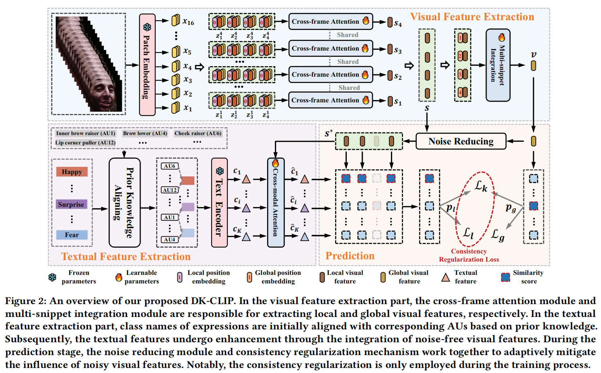

# Domain Knowledge Enhanced Vision-Language Pretrained Model for Dynamic Facial Expression Recognition (ACM MM2024)

This repo is the official PyTorch implementation for the paper "Domain Knowledge Enhanced Vision-Language Pretrained Model for Dynamic Facial Expression Recognition".

# Training
```
torchrun --nproc_per_node=2 --master_port=12348 main.py --config=configs/dfew/dfew.yaml
```
# Detailed Experimental Results
### DFEW
| Fold       | Happy       |Sad       |Neutral    |Angry |Surprise|Disgust |Fear       |UAR       |WAR|
|:-----------|:-----------:|:-----------:|:-----------:|:-----------:|:-----------:|:-----------:|:-----------:|:-----------:|:-----------:|
| 1       | 94.27       |76.77    |78.08    |69.07 |9.38 |	37.09 |	63.29 |	76.21|
| 2       | 95.95       |72.87    |70.56    |60.89 |24.05 |	41.46 |	63.01 |	73.22|
| 3       | 93.48       |72.59    |82.09    |64.59 |23.74 |	33.94 |	64.21 |	75.56|
| 4       | 93.44       |74.79    |84.10    |61.57 |30.53 |	52.71 |	66.16 |	74.48|
| 5       | 95.90       |83.93    |78.44    |61.93 |30.29 |	49.46 |	68.06 |	77.57|
| Avg     | 94.61       |76.19    |78.65    |63.61 |23.60 |	42.93 |	64.95 |	75.41|
The relevant run logs can be viewed log/.
# Acknowledgement
We appreciate the pioneer project [X-CLIP](https://github.com/microsoft/VideoX/tree/master/X-CLIP).
